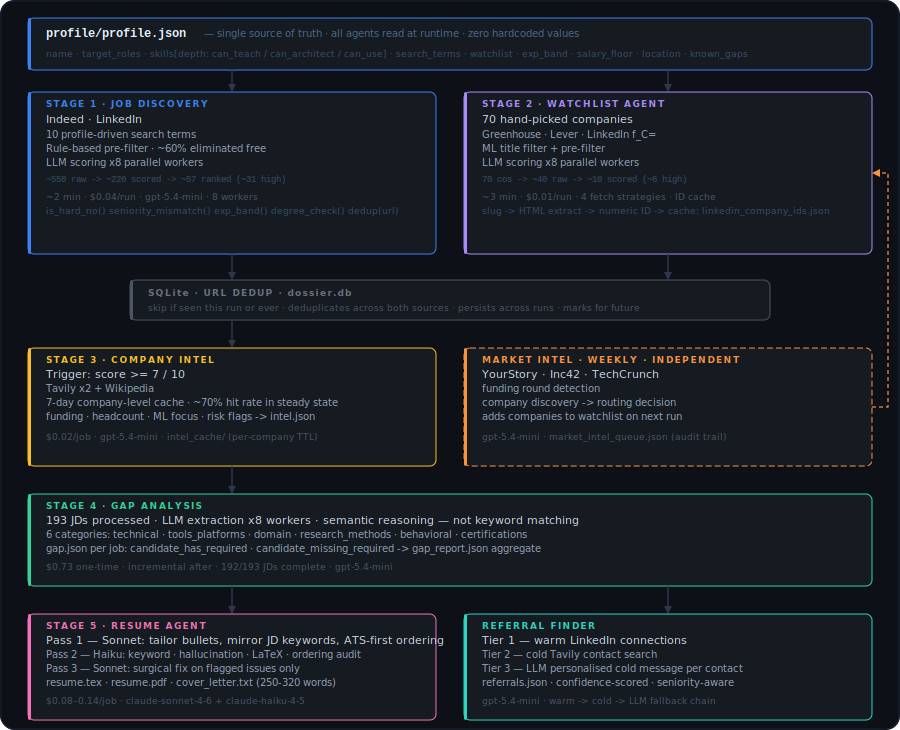

<a name="readme-top"></a>

> **Repo layout (post M0 — May 2026):**
> - [`sdk/`](sdk/) — installable Python SDK (`dossier-sdk`). Contains all agents, core utilities, prompts, config.
> - [`backend/`](backend/) — FastAPI service (starts M2). Wraps the SDK with HTTP + Clerk auth + credits.
> - [`frontend/`](frontend/) — Next.js 16 SaaS web app (starts M1). Replaces `dashboard.py` after M4.
> - [`dashboard.py`](dashboard.py) — Legacy Streamlit dashboard. Still works during transition. Retired post-M4.
> - [`data/`](data/), [`profile/`](profile/) — Unchanged. Per-user pipeline data + persona files.
> - [`scripts/`](scripts/) — CLI entry scripts. Updated to import from `dossier_sdk`.
> - [`docs/superpowers/specs/`](docs/superpowers/specs/) — Design specs.
> - [`docs/superpowers/milestones/`](docs/superpowers/milestones/) — Per-milestone implementation plans (M0–M11).
> - [`frontend-todo.txt`](frontend-todo.txt) — Live aggregated task tracker across milestones.
>
> **Quick install:** `uv sync` from repo root installs everything (SDK editable + dashboard deps).
> **Run pipeline:** `python run_dossier.py --user shivang --mode quick`
> **Run dashboard:** `streamlit run dashboard.py`

<div align="center">

<br/>


<br/><br/>

<!-- Tech stack -->
[](https://www.python.org/)
[](https://docs.astral.sh/uv/)
[](https://platform.openai.com/)
[](https://anthropic.com/)
[](LICENSE)

<br/>

<!-- Live stats -->
[]()
[]()
[]()
[]()

<br/>

[Why Dossier](#-why-not-just-use-a-job-board) · [What's inside](#-whats-inside) · [Quick start](#-quick-start) · [How it works](#-how-it-works) · [Roadmap](#-roadmap)

<br/>

> **Dossier is not a job board wrapper or a resume template tool.**
> It is a quality-first agentic pipeline that finds, scores, researches, and surfaces
> the roles most worth your time — so you apply to fewer roles, better, earlier.

<br/>

</div>

---

## ✦ Why not just use a job board?

Job boards give you *more*. Dossier gives you *signal*.

<br/>

<table>
<thead>
<tr>
<th align="left"></th>
<th align="center">Job boards</th>
<th align="center">Mass-apply bots</th>
<th align="center" bgcolor="#0d2137"><strong>✦ Dossier</strong></th>
</tr>
</thead>
<tbody>
<tr>
<td>Finds roles at <em>your</em> target companies</td>
<td align="center">sometimes</td>
<td align="center">✗</td>
<td align="center" bgcolor="#0d2137"><strong>✓</strong></td>
</tr>
<tr>
<td>Scores against <em>your specific</em> profile</td>
<td align="center">✗</td>
<td align="center">✗</td>
<td align="center" bgcolor="#0d2137"><strong>✓</strong></td>
</tr>
<tr>
<td>Eliminates 60% of noise before spending anything</td>
<td align="center">✗</td>
<td align="center">✗</td>
<td align="center" bgcolor="#0d2137"><strong>✓</strong></td>
</tr>
<tr>
<td>Researches the company before you click apply</td>
<td align="center">✗</td>
<td align="center">✗</td>
<td align="center" bgcolor="#0d2137"><strong>✓</strong></td>
</tr>
<tr>
<td>Tells you which skills you're actually missing</td>
<td align="center">✗</td>
<td align="center">✗</td>
<td align="center" bgcolor="#0d2137"><strong>✓</strong></td>
</tr>
<tr>
<td>Finds promoted listings keyword search never sees</td>
<td align="center">✗</td>
<td align="center">✗</td>
<td align="center" bgcolor="#0d2137"><strong>✓</strong></td>
</tr>
<tr>
<td>Cost per week of daily runs</td>
<td align="center">$0</td>
<td align="center">$20–50/mo</td>
<td align="center" bgcolor="#0d2137"><strong>~$0.30</strong></td>
</tr>
<tr>
<td>Applications sent</td>
<td align="center">high volume</td>
<td align="center">very high</td>
<td align="center" bgcolor="#0d2137"><strong>fewer, better</strong></td>
</tr>
</tbody>
</table>

<br/>

The average ML/AI engineer sends 80+ applications and gets 5 responses. Dossier is built on the opposite thesis: send 10 targeted applications with full context on each company, and get 5 responses.

<p align="right">(<a href="#readme-top">back to top</a>)</p>

---

## ✦ What's inside

Eight agents working together. Each is independently useful.

<br/>

<table>
<tr>
<td width="50%" valign="top" bgcolor="#0d1a2e">


### 🔍 Job Discovery
Multi-source keyword search across **Indeed + LinkedIn** using 10 profile-driven search terms. A rule-based pre-filter eliminates ~60% of results before spending a single LLM token. The survivors are parallel-scored in ~2 minutes.

```
~550 raw  ──pre-filter──▶  ~220 scored  ──LLM──▶  ~57 ranked
                                                    ┗ ~31 high relevancy
```

 &nbsp; &nbsp;

</td>
<td width="50%" valign="top" bgcolor="#130c26">


### 🎯 Watchlist Agent
Company-specific search across **70 hand-picked companies** using LinkedIn `f_C=` filters, Greenhouse, and Lever free JSON APIs. Catches promoted listings that keyword search never surfaces.

```
70 companies  ──per-company──▶  ~40 raw  ──LLM──▶  ~10 scored
                                                     ┗ ~6 high relevancy
```

 &nbsp; &nbsp;

</td>
</tr>
<tr>
<td width="50%" valign="top" bgcolor="#1a1400">


### 🏢 Company Intel
For every job scoring ≥ 7/10: one command replaces 30 minutes of Googling. Funding stage, headcount estimate, ML focus, risk flags, recent news — synthesised from Tavily + Wikipedia into a structured JSON artifact. 7-day cache keeps costs near zero.

```
score ≥ 7  ──Tavily (×2)──▶  raw snippets
           ──Wikipedia──▶    context
           ──GPT-5.4-mini──▶  intel.json
```

 &nbsp; &nbsp;

</td>
<td width="50%" valign="top" bgcolor="#08180a">


### 📊 Gap Analysis
Semantic skill extraction across all accumulated JDs. Not keyword matching — the LLM reads your full profile and reasons about capability equivalence. Tells you exactly what the market wants that you don't claim yet.

```
193 JDs  ──LLM (×8)──▶  6-category extraction
         ──semantic──▶   has / missing split
         ──aggregate──▶  gap_report.json
```

 &nbsp; &nbsp;

</td>
</tr>
</table>

<br/>

<details>
<summary><strong>+ 4 more agents in the pipeline</strong></summary>

<br/>

<table>
<thead>
<tr><th align="left">Agent</th><th align="left">What it does</th><th align="center">Status</th></tr>
</thead>
<tbody>
<tr>
<td><strong>Persona Builder</strong></td>
<td>Terminal interview → <code>profile.json</code> (the source of truth for all agents)</td>
<td align="center" bgcolor="#0a1e0a"></td>
</tr>
<tr>
<td><strong>Market Intel</strong></td>
<td>Monitors YourStory / Inc42 / TechCrunch for new AI/ML funding rounds. Routes companies to watchlist or cold outreach</td>
<td align="center" bgcolor="#0a1e0a"></td>
</tr>
<tr>
<td><strong>Resume Agent</strong></td>
<td>3-pass self-evaluation: Sonnet tailor → Haiku critic → Sonnet revise. Hallucination guard + ATS keyword mirroring enforced. ~$0.08–0.14/application</td>
<td align="center" bgcolor="#0a1e0a"></td>
</tr>
<tr>
<td><strong>Referral Finder</strong></td>
<td>3-tier contact search: warm LinkedIn connections → cold Tavily search → personalised LLM cold message per contact. Confidence-scored, seniority-aware</td>
<td align="center" bgcolor="#0a1e0a"></td>
</tr>
</tbody>
</table>

</details>

<p align="right">(<a href="#readme-top">back to top</a>)</p>

---

## ✦ Quick start

**Prerequisites:** Python 3.12+, [uv](https://docs.astral.sh/uv/), OpenAI API key

```bash
# 1 · Clone and install
git clone https://github.com/shivangsingh26/dossier.git
cd dossier && uv sync

# 2 · Add your API keys
cp .env.example .env
#    → open .env, add OPENAI_API_KEY and ANTHROPIC_API_KEY

# 3 · Build your profile (one-time, ~5 min)
uv run python scripts/run_persona_builder.py

# 4 · Run the full daily pipeline
uv run python run_dossier.py
```

That's it. One command runs discovery → watchlist → company intel → scored output.

<br/>

<details>
<summary><strong>Run stages individually</strong></summary>

<br/>

```bash
# Keyword discovery — last 10 days, all scores
uv run python scripts/run_job_discovery.py --hours 240

# High-relevancy only — last 3 days
uv run python scripts/run_job_discovery.py --hours 72 --min-score 7

# Watchlist — all 70 target companies
uv run python scripts/run_watchlist.py --min-score 5

# Company intel — research jobs you're interested in
uv run python scripts/run_company_intel.py --min-score 7 --source both

# Gap analysis — run once, then incrementally
uv run python scripts/run_gap_analysis.py --top 15

# Market intel — run weekly, not daily
uv run python scripts/run_market_intel.py

# Referral finder — warm connections + cold Tavily search + LLM cold messages
uv run python scripts/run_referral_finder.py --list
uv run python scripts/run_referral_finder.py --job-id <job_id>
uv run python scripts/run_referral_finder.py --job-id <job_id> --no-csv

# Resume + cover letter for a specific job (3-pass self-evaluation)
uv run python scripts/run_resume_agent.py --list
uv run python scripts/run_resume_agent.py --job-id <job_id>
uv run python scripts/run_resume_agent.py --job-id <job_id> --version

# Onboard a new user — generate a fillable questionnaire
uv run python scripts/export_questionnaire.py --user <name>

# Verify all LLM providers are responding
uv run python tests/test_llm_client.py
```

</details>

<p align="right">(<a href="#readme-top">back to top</a>)</p>

---

## ✦ How it works



<br/>

<details>
<summary><strong>Pre-filter logic — zero LLM spend</strong></summary>

<br/>

Every job passes through these gates **before** reaching the LLM. Order matters — each gate is cheaper than the next.

```
is_hard_no()              ← service cos (TCS · Infosys · NTT DATA · Happiest Minds...)
                            IT staffing, job aggregators
description < 100 chars   ← no content = no signal
is_seniority_mismatch()   ← profile-driven: Senior · Staff · VP · Intern · Apprenticeship
classify_job_function()   ← support_ops (SRE / DevOps / pure Infra) → cap at 3
extract_years_required()  ← > exp_band max → hard reject (no LLM wasted)
extract_degree_required() ← PhD → hard reject · Masters → soft penalty note to LLM
is_job_seen(url)          ← SQLite dedup · already scored this run or ever → skip
```

~60% of raw jobs are eliminated here. The LLM only sees candidates worth scoring.

</details>

<br/>

<details>
<summary><strong>Semantic gap analysis — how the matching works</strong></summary>

<br/>

The gap agent doesn't keyword-match. It sends your full profile summary alongside every JD and asks the LLM to reason about capability equivalence.

```
JD says "PyTorch"
  + profile has "Computer Vision [can_architect]: YOLO, RF-DETR, MobileNetV2, Deep Learning"
  → candidate HAS PyTorch  ✓  (domain at architect depth implies the core framework)

JD says "RAG"
  + profile has "RAG Systems [can_architect]: LlamaIndex, LangChain, ChromaDB, FAISS"
  → candidate HAS RAG  ✓  (exact alias match)

JD says "SQL"
  + profile has no SQL alias anywhere
  → candidate MISSING SQL  ✗  (never inferred from Python/ML background alone)
```

Six categories per JD: `technical` · `tools_platforms` · `domain` · `research_methods` · `behavioral` · `certifications`

Each job gets a `gap.json` (schema v2) with `candidate_has_required` and `candidate_missing_required` lists. The resume agent reads these to decide which bullets to lead with.

**Current market signal (193 JDs):**

| Required gap | % of JDs | | Strong match | % of JDs |
|---|---|---|---|---|
| SQL | 42% | | Python | 79% |
| Cross-functional Collaboration | 38% | | AWS | 37% |
| NLP (domain) | 24% | | RAG | 27% |
| TensorFlow | 22% | | GCP | 21% |
| Java | 16% | | | |

</details>

<br/>

<details>
<summary><strong>Watchlist — why company-specific beats keyword search</strong></summary>

<br/>

Keyword search returns jobs that LinkedIn and Indeed want to show you. Company-specific `f_C=` search returns **every current opening** at that company, including promoted listings, internal transfers, and roles posted without common ML keywords.

```
Greenhouse API    boards-api.greenhouse.io/v1/boards/{token}/jobs   (free JSON, clean data)
Lever API         api.lever.co/v0/postings/{handle}?mode=json        (free JSON)
LinkedIn f_C=     company-specific search with numeric ID filter

LinkedIn ID resolver:
  slug → multi-pattern HTML extraction → numeric company ID
       → cache: data/linkedin_company_ids.json  (auto-grows, 45+ entries)
       → fallback: /about/ page if main page fails
```

The scraper uses `requests.Session()` for TCP reuse, exponential backoff on 429 (`30s → 60s → 120s`), ±40% jitter on all sleeps, and parallel description fetching with slot-based stagger — so LinkedIn doesn't see a burst pattern.

</details>

<p align="right">(<a href="#readme-top">back to top</a>)</p>

---

## ✦ Company coverage

70 companies across four tiers, all with verified LinkedIn slugs and ATS types.

<br/>

<table>
<tr>
<td valign="top" width="22%" bgcolor="#1a0a0a">

 &nbsp;`6`

Google · Microsoft
Amazon · Meta
Apple · Netflix

</td>
<td valign="top" width="26%" bgcolor="#0d1530">

 &nbsp;`19`

Uber · Stripe · Adobe · Atlassian
Salesforce · Intuit · NVIDIA · AMD
Qualcomm · PayPal · Databricks
Airbnb · LinkedIn · Coinbase
Wayfair · Target · Hotstar
Zoho · Walmart GTC

</td>
<td valign="top" width="30%" bgcolor="#08180a">

 &nbsp;`30`

Flipkart · Zepto · Swiggy · Meesho
Razorpay · PhonePe · CRED · Dream11
Groww · Juspay · Browserstack
Freshworks · Postman · InMobi · Ola
Zomato · Myntra · MakeMyTrip
Delhivery · upGrad · BharatPe
Tata 1mg · Physics Wallah
Urban Company · Rapido · Lenskart
Porter · ixigo · OYO · MPL

</td>
<td valign="top" width="22%" bgcolor="#130c26">

 &nbsp;`10`

Sarvam AI · Krutrim AI
Uniphore · Yellow.ai
Observe.AI · Vue.ai
Sprinklr · Darwinbox
Auric AI Labs · Haptik

</td>
</tr>
</table>

<br/>

> Companies that can't be scraped (LinkedIn API returning 0, unresolvable slugs, etc.) are tracked in `profile/exception_companies.json` with the exact failure category, so future fixes are targeted.

<p align="right">(<a href="#readme-top">back to top</a>)</p>

---

## ✦ Profile configuration

`profile/profile.json` is the single source of truth. Every agent reads from it at runtime — nothing is hardcoded anywhere. To use Dossier for a different person, replace this file.

```json
{
  "identity": {
    "name": "Your Name",
    "short_title": "AI Engineer",
    "total_experience_months": 20,
    "notice_period_months": 2,
    "location": "Bengaluru"
  },
  "target": {
    "roles": ["MLE-1", "AI Engineer", "Data Scientist"],
    "role_domain": "ml_ai",
    "search_terms": ["Machine Learning Engineer", "LLM Engineer", "..."],
    "watchlist_title_keywords": ["machine learning", "data scientist", "llm", "..."],
    "min_salary_lpa": 25,
    "switch_timeline_months": 8
  },
  "skills": [
    {
      "skill": "LLM Pipeline Engineering",
      "depth": "can_architect",
      "market_aliases": ["LLM pipelines", "agentic AI", "GenAI systems"]
    }
  ],
  "known_gaps": ["LLM fine-tuning", "Distributed training"]
}
```

<br/>

**Depth levels** tell the gap agent how much to infer:

| Depth | Meaning | Inference |
|---|---|---|
| `can_teach` | Deep expertise — you can explain it to others | High |
| `can_architect` | Production experience — you've built systems with it | Medium |
| `can_use` | Working knowledge — you've used it in projects | Low |

<p align="right">(<a href="#readme-top">back to top</a>)</p>

---

## ✦ LLM strategy

Cost is matched to task complexity. High-volume tasks use the cheapest reliable model. One-off quality tasks use better models. LaTeX work always goes to Claude.

<br/>

<table>
<thead>
<tr><th align="left">Task</th><th align="left">Model</th><th align="center">Tier</th><th align="left">Reason</th></tr>
</thead>
<tbody>
<tr>
<td>Job scoring</td><td><code>gpt-5.4-mini</code></td>
<td align="center" bgcolor="#0a1e0a"></td>
<td>Runs on every job — cost is the only constraint</td>
</tr>
<tr>
<td>Skill extraction (gap)</td><td><code>gpt-5.4-mini</code></td>
<td align="center" bgcolor="#0a1e0a"></td>
<td>Batch across 200+ JDs</td>
</tr>
<tr>
<td>Company intel synthesis</td><td><code>gpt-5.4-mini</code></td>
<td align="center" bgcolor="#0a1e0a"></td>
<td>Noisy scraped data needs reasoning</td>
</tr>
<tr>
<td>Market intel extraction</td><td><code>gpt-5.4-mini</code></td>
<td align="center" bgcolor="#0a1e0a"></td>
<td>Structured JSON from news snippets</td>
</tr>
<tr>
<td>Cold message drafting</td><td><code>gpt-5.4-mini</code></td>
<td align="center" bgcolor="#0a1e0a"></td>
<td>Prompt-driven quality; gpt-5 caused silent empty outputs</td>
</tr>
<tr>
<td>Persona builder</td><td><code>gpt-5</code></td>
<td align="center" bgcolor="#0d1530"></td>
<td>Conversational depth matters</td>
</tr>
<tr>
<td>Cover letter</td><td><code>claude-haiku-4-5</code></td>
<td align="center" bgcolor="#1a1000"></td>
<td>Good writing, cost-efficient</td>
</tr>
<tr>
<td>Resume bullets (LaTeX)</td><td><code>claude-sonnet-4-6</code></td>
<td align="center" bgcolor="#1a1000"></td>
<td>LaTeX-aware, highest precision</td>
</tr>
</tbody>
</table>

All model names live in `config.py` only — changing any model is a one-line edit.

**Cost reference:** `gpt-5.4-mini` at $0.75/M input. A full week of daily discovery + watchlist ≈ **$0.30**. Gap analysis is **$0.73 one-time**, then incremental. Company intel ≈ **$0.02/job** with 7-day Tavily cache.

<p align="right">(<a href="#readme-top">back to top</a>)</p>

---

## ✦ Roadmap

<br/>

<table>
<thead><tr><th align="left">Feature</th><th align="center">Status</th></tr></thead>
<tbody>
<tr><td>Multi-source keyword discovery (Indeed + LinkedIn, 10 search terms)</td><td align="center" bgcolor="#08180a"></td></tr>
<tr><td>Two-pass scoring — rule-based pre-filter + parallel LLM (×8 workers)</td><td align="center" bgcolor="#08180a"></td></tr>
<tr><td>Ground-truth company tier lookup (70 companies, verified)</td><td align="center" bgcolor="#08180a"></td></tr>
<tr><td>Profile-driven seniority + experience band gating</td><td align="center" bgcolor="#08180a"></td></tr>
<tr><td>Parent-company dedup (<code>Amazon.com</code> + <code>Amazon Science</code> = 1 diversity slot)</td><td align="center" bgcolor="#08180a"></td></tr>
<tr><td>Watchlist agent — Greenhouse / Lever / LinkedIn <code>f_C=</code></td><td align="center" bgcolor="#08180a"></td></tr>
<tr><td>LinkedIn company ID resolver with persistent disk cache</td><td align="center" bgcolor="#08180a"></td></tr>
<tr><td>Company intel agent — Tavily + Wikipedia + 7-day cache</td><td align="center" bgcolor="#08180a"></td></tr>
<tr><td>SQLite dedup — skip rescoring jobs seen in previous runs</td><td align="center" bgcolor="#08180a"></td></tr>
<tr><td>Master orchestrator — <code>run_dossier.py</code></td><td align="center" bgcolor="#08180a"></td></tr>
<tr><td>Market intel agent — funding news → company discovery → routing</td><td align="center" bgcolor="#08180a"></td></tr>
<tr><td>Gap analysis agent — semantic extraction across 193 JDs</td><td align="center" bgcolor="#08180a"></td></tr>
<tr><td>Resume agent — 3-pass self-evaluation (tailor → critique → revise)</td><td align="center" bgcolor="#08180a"></td></tr>
<tr><td>Referral finder — 3-tier contact search + personalised cold messages</td><td align="center" bgcolor="#08180a"></td></tr>
<tr><td><strong>Cold outreach generator</strong> — structured send queue, follow-up tracking</td><td align="center" bgcolor="#1a1200"></td></tr>
<tr><td>Telegram alerts — URGENT jobs pushed within minutes of posting</td><td align="center" bgcolor="#0d1530"></td></tr>
<tr><td>LTR scorer — trained on apply/response signal after 200+ labels</td><td align="center" bgcolor="#14101e"></td></tr>
</tbody>
</table>

<br/>

**Product tiers:**

<table>
<thead><tr><th align="left">Tier</th><th align="left">What you get</th></tr></thead>
<tbody>
<tr>
<td bgcolor="#0d1530"></td>
<td bgcolor="#0d1530">Keyword discovery · Indeed + LinkedIn · LLM scoring</td>
</tr>
<tr>
<td bgcolor="#130c26"></td>
<td bgcolor="#130c26">+ Watchlist (70 companies) · company intel · orchestrator</td>
</tr>
<tr>
<td bgcolor="#1a1000"></td>
<td bgcolor="#1a1000">+ Market intel · gap analysis · referral finder · resume agent</td>
</tr>
</tbody>
</table>

Lite and Pro are ✅ built. Max is ✅ feature-complete — gap analysis + resume agent + referral finder all done. Cold outreach queue is next.

<p align="right">(<a href="#readme-top">back to top</a>)</p>

---

## ✦ Project structure

```
dossier/
│
├── run_dossier.py                  master orchestrator — one daily command, 4 modes
├── config.py                       singleton config · all model name constants
│
├── agents/
│   ├── job_discovery.py            keyword search → pre-filter → LLM score → ranked output
│   ├── watchlist_agent.py          company-specific (Greenhouse · Lever · LinkedIn f_C=)
│   ├── company_intel.py            Tavily + Wikipedia → structured intel per job
│   ├── market_intel_agent.py       funding news → company discovery → routing
│   ├── gap_analysis.py             semantic skill extraction → gap.json per job
│   ├── referral_finder.py          3-tier contact search → referrals.json + cold messages
│   ├── resume_agent.py             3-pass resume tailoring + cover letter per job
│   └── persona_builder.py          terminal interview → profile.json
│
├── core/
│   ├── llm_client.py               unified interface: OpenAI + Anthropic · retry · tracking
│   ├── linkedin_scraper.py         guest API · company ID resolver · Session · backoff · jitter
│   ├── file_vault.py               per-job artifact storage
│   ├── db.py                       SQLite dedup — is_job_seen / mark_job_seen
│   ├── intel_cache.py              company-level Tavily cache (7-day TTL)
│   ├── utils.py                    parse_json_response — safe LLM JSON parsing
│   └── logger.py                   structured logging · module-level loggers
│
├── prompts/
│   ├── job_scoring_system.txt      LLM scorer prompt
│   ├── skill_extract_system.txt    gap analysis extraction + semantic matching rules
│   ├── resume_tailor_system.txt    Pass 1 — 10-rule tailoring prompt (no fabrication)
│   ├── resume_critique_system.txt  Pass 2 — 4-check audit (keyword mirror · hallucination · LaTeX · ordering)
│   ├── resume_revise_system.txt    Pass 3 — surgical fix prompt (only flagged issues)
│   └── cover_letter_system.txt     cover letter (250–320 words, 8 banned clichés)
│
├── profile/
│   ├── profile.json                your persona — source of truth (gitignored)
│   ├── target_companies.json       70 companies: tier · slug · ATS type · funding metadata
│   └── exception_companies.json    unscrapable companies + exact failure category
│
├── scripts/
│   ├── run_job_discovery.py        --hours  --min-score
│   ├── run_watchlist.py            --min-score  --location
│   ├── run_company_intel.py        --min-score  --source
│   ├── run_gap_analysis.py         --force  --min-score  --top
│   ├── run_market_intel.py         run weekly
│   ├── run_referral_finder.py      --list  --job-id  --no-csv
│   ├── run_resume_agent.py         --list  --job-id  --version
│   └── export_questionnaire.py     --user <name>  (generate fillable questionnaire for other users)
│
└── data/
    ├── dossier.db                  SQLite · all seen job URLs
    ├── gap_report.json             aggregate skill frequency report
    ├── market_intel_queue.json     companies found by market intel (audit trail)
    ├── intel_cache/                per-company Tavily cache (7-day TTL)
    └── artifacts/{job_id}/
        ├── jd.txt                  raw job description
        ├── score_card.json         score · tier · urgency · reason · skills gap
        ├── intel.json              funding · headcount · ML focus · risk flags
        ├── gap.json                required/preferred skills · has/missing split (v2)
        ├── referrals.json          contacts found (name · title · tier · confidence · cold message)
        ├── resume.tex              tailored LaTeX resume (resume_v2.tex etc. with --version)
        ├── resume.pdf              compiled PDF (pdflatex · page count checked)
        └── cover_letter.txt        250–320 word tailored cover letter
```

<p align="right">(<a href="#readme-top">back to top</a>)</p>

---

<div align="center">

<br/>

Built for engineers who want to work at places worth working at.

<br/>

[](https://github.com/shivangsingh26/dossier)

<br/>

</div>
